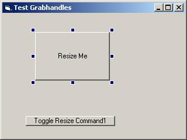



## Grab Handles

### Description

Allows user to resize a control at runtime.

Put the UserControl on a form and use the

Attach method to size a particular control.

There is an API way to do this, using CreateWindowEx, but I wanted to do it with a UserControl &amp; here's the result. Enjoy.
 
### More Info
 

             |
---                |---
**Submitted On**   |2007-08-06 10:54:34
**By**             |[Norm Cook](https://github.com/Planet-Source-Code/PSCIndex/blob/master/ByAuthor/norm-cook.md)
**Level**          |Intermediate
**User Rating**    |4.9 (34 globes from 7 users)
**Compatibility**  |VB 6\.0
**Category**       |[Custom Controls/ Forms/  Menus](https://github.com/Planet-Source-Code/PSCIndex/blob/master/ByCategory/custom-controls-forms-menus__1-4.md)
**World**          |[Visual Basic](https://github.com/Planet-Source-Code/PSCIndex/blob/master/ByWorld/visual-basic.md)
**Archive File**   |[Grab\_Handl207848862007\.zip](https://github.com/Planet-Source-Code/norm-cook-grab-handles__1-69106/archive/master.zip)

### API Declarations

SetParent

